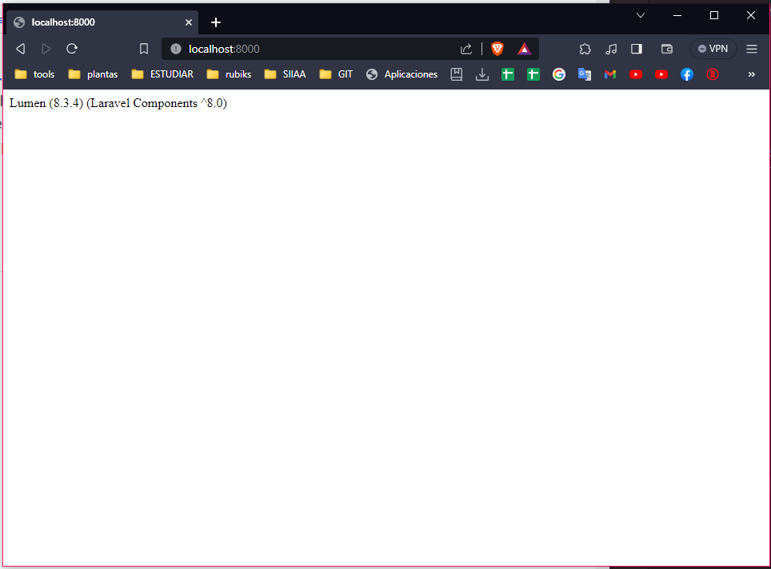
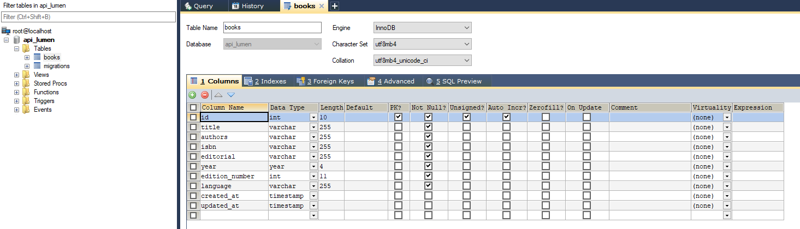
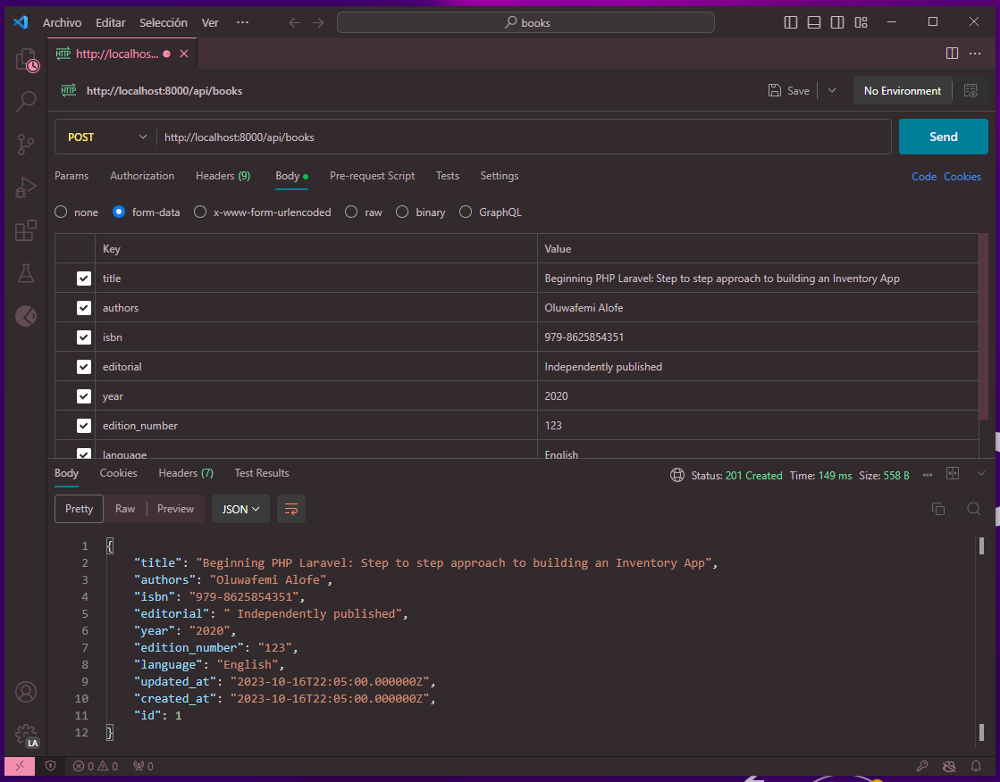
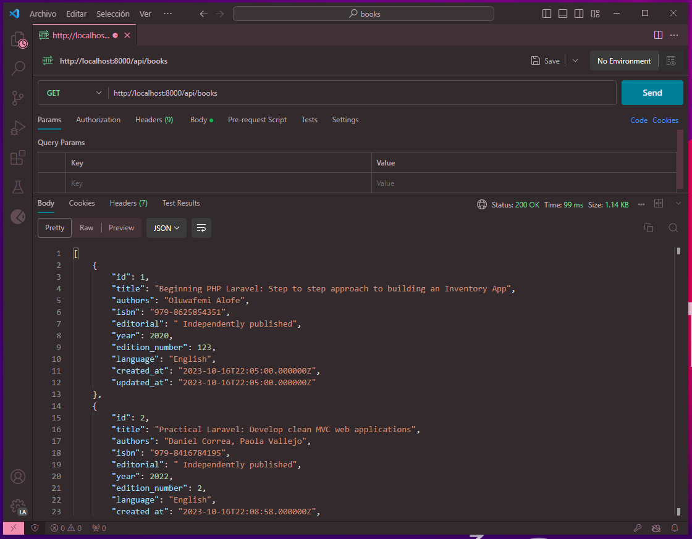
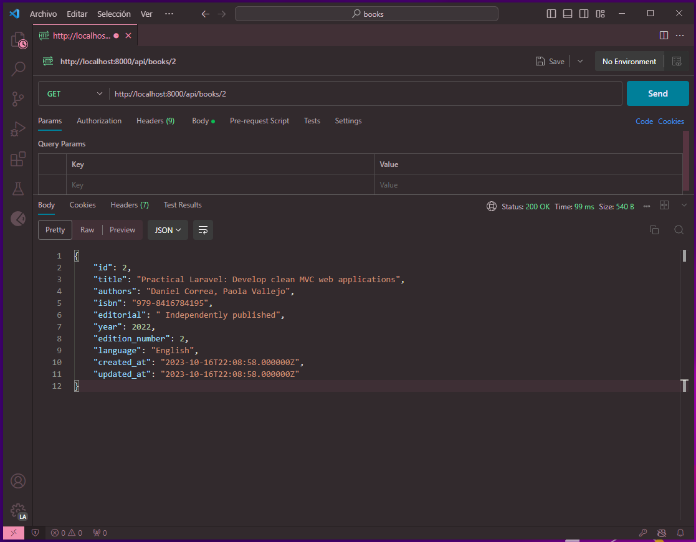
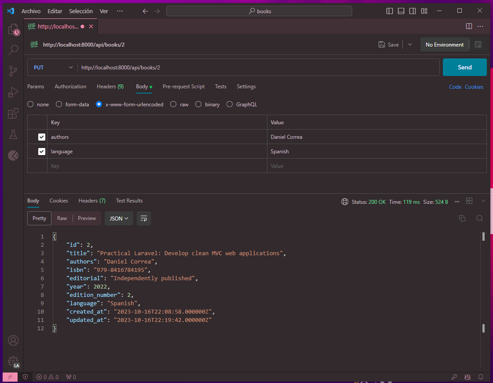
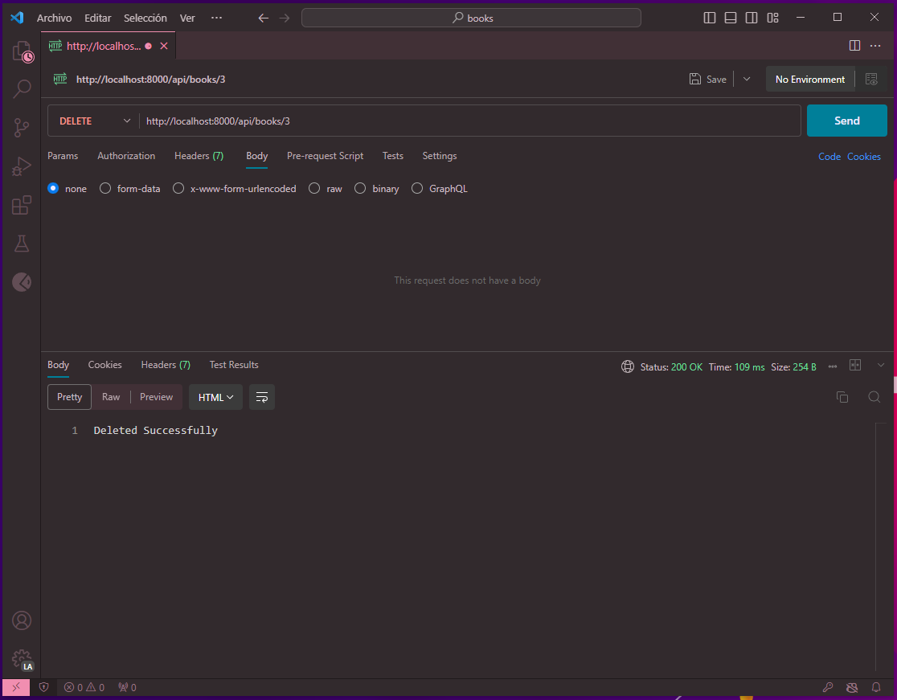
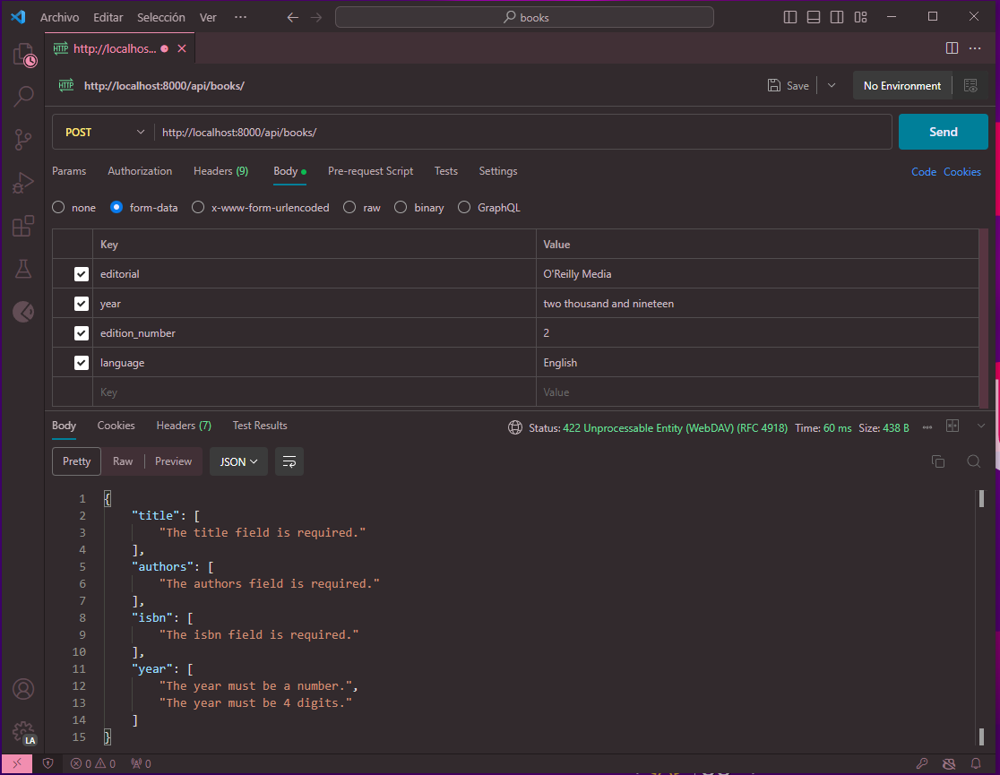

# Desarrollo de API RESTful con Lumen (Micro-Framework de PHP)

[Lumen](https://lumen.laravel.com/) es un microframework PHP de código abierto creado por Taylor Otwell como una alternativa a Laravel para satisfacer la demanda de instalaciones livianas que son más rápidas que los microframeworks PHP existentes como Slim y Silex. Con Lumen, puede crear microservicios y API ultrarrápidos que puedan admitir sus aplicaciones Laravel.


## Características y arquitectura de Lumen
Lumen utiliza los componentes Illuminate que impulsan el Framework [Laravel](https://laravel.com/). Como tal, Lumen está diseñado para actualizarse directamente a Laravel sin problemas cuando sea necesario.

## Estas son algunas de las características integradas de Lumen:
* El **Routing** se proporciona listo para usar en Lumen. Esto incluye enrutamiento básico, parámetros de enrutamiento, rutas con nombre y grupos de rutas como middleware.
* La **Authentication** que no admite el estado de la sesión. Sin embargo, las solicitudes entrantes se autentican mediante mecanismos sin estado, como tokens.
* El **Caching** se implementa igual que en Laravel. Se admiten controladores de caché como Database, Memcached y Redis
* Los **Errors and Logging** se implementan a través de la biblioteca Monolog, que brinda soporte para varios controladores de registros.
* El **Bootstrapping processes** que se encuentran en un único archivo.

---

Este repositorio proporciona una guía básica para crear una API RESTful de libros utilizando el MicroFramework Lumen de Laravel. La API permitirá realizar operaciones CRUD (Crear, Leer, Actualizar y Eliminar) en una colección de libros.

## Requisitos

Antes de comenzar, asegúrate de tener instalados los siguientes componentes:

- [PHP](https://www.php.net/) (se recomienda PHP 7.2 o superior)
- [Composer](https://getcomposer.org/)


## Instalar Lumen
- Ejecute el siguiente comando en su terminal para crear un nuevo proyecto con Lumen:
    ```bash
    composer create-project --prefer-dist laravel/lumen books
    ```
- `cd` en el proyecto recién creado.
    ```bash
    cd books
    ```
- Ahora, ejecute `php -S localhost:8000 -t public` para ejecutar el proyecto. Dirígete a tu navegador. Deberías ver la página de inicio así:
  

## Activar Eloquent y Facades
Como se mencionó anteriormente, todo el proceso de arranque se encuentra en un solo archivo.

Abra `bootstrap/app.php` y descomente esta línea, `// app->withEloquent`. Una vez descomentado, Lumen conecta el ORM de Eloquent con su base de datos utilizando las conexiones configuradas en el archivo `.env`.

> Asegúrese de configurar los detalles correctos para su base de datos en el archivo `.env`.

A continuación descomenté esta línea `//$app->withFacades();`, lo que nos permite hacer uso de Facades en nuestro proyecto.

## Configurar Base de Datos, Modelo y Migraciones

Lumen admite cuatro sistemas de bases de datos: MySQL, Postgres, SQLite y SQL Server. En este caso estaremos haciendo uso de MySQL. 

1. Crear nuestra base de datos con el nombre configurado en el archivo `.env`.
2. Genenerar la migración para la tabla books con el siguiente comando
   ```bash
   php artisan make:migration create_books_table
3. Abrir el archivo de la migracion y modificar el metodo `up` con lo siguiente:
   ```php
    public function up()
    {
        Schema::create('books', function (Blueprint $table) {
            $table->increments('id');
            $table->string('title');
            $table->string('authors');
            $table->string('isbn');
            $table->string('editorial');
            $table->year('year');
            $table->integer('edition_number');
            $table->string('language');
            $table->timestamps();
        });
    }

La nueva migración se colocará en la carpeta `database/migrations`. Cada nombre de archivo de migración contiene una marca de tiempo, que permite a Lumen determinar el orden de las migraciones.

4. Ejecuta la migración para crear la tabla:
   ```bash
    php artisan migrate
5. Consulta tu base de datos. Ahora debería tener presentes las tablas de `books` y `migraciones`.
    
6. Creemos el modelo de `Book`. Cree un archivo en `app/Book.php` y agréguele el siguiente código:
   ```php
   <?php

        namespace App;
        use Illuminate\Database\Eloquent\Model;

        class Book extends Model
        {
            /**
            * The attributes that are mass assignable.
            *
            * @var array
            */
            protected $fillable = [
                'title', 'authors', 'isbn', 'editorial', 'year', 'edition_number', 'language'
            ];

            /**
            * The attributes excluded from the model's JSON form.
            *
            * @var array
            */
            protected $hidden = [];
        }

## Configurar rutas
El enrutamiento es bastante sencillo. Abre `routes/web.php` y agrega lo siguiente:
```php
$router->group(['prefix' => 'api'], function () use ($router) {
    $router->get('books',  ['uses' => 'BookController@showAllBooks']);
    $router->get('books/{id}', ['uses' => 'BookController@showOneBook']);
    $router->post('books', ['uses' => 'BookController@create']);
    $router->delete('books/{id}', ['uses' => 'BookController@delete']);  
    $router->put('books/{id}', ['uses' => 'BookController@update']);
});
```
En el código anterior, hemos resumido la funcionalidad de cada ruta en el controlador `BooksController`. Los grupos de rutas permiten compartir atributos, como middleware o namespaces, en una gran cantidad de rutas sin necesidad de definir esos atributos en cada una de ellas. Por lo tanto, cada ruta tendrá el prefijo `/api`. A continuación, creemos el controlador.

## Configurar el controlador Book
Cree un nuevo archivo, `BooksController.php` en el directorio `app/Http/Controllers` y agréguele el siguiente código de esta manera:
```php
<?php

    namespace App\Http\Controllers;
    use App\Book;
    use Illuminate\Http\Request;

    class BookController extends Controller
    {
        public function showAllBooks()
        {
            return response()->json(Book::all());
        }

        public function showOneBook($id)
        {
            return response()->json(Book::find($id));
        }

        public function create(Request $request)
        {
            $this->validate($request, [
                'title' => 'required',
                'authors' => 'required',
                'isbn' => 'required|unique:books',
                'year' => 'required|numeric|digits:4',
                'edition_number' => 'numeric'
            ]);
            $book = Book::create($request->all());
            return response()->json($book, 201);
        }

        public function update($id, Request $request)
        {
            $book = Book::findOrFail($id);
            $book->update($request->all());
            return response()->json($book, 200);
        }

        public function delete($id)
        {
            Book::findOrFail($id)->delete();
            return response('Deleted Successfully', 200);
        }
    }
```
Analicemos el código anterior. Primero, usamos `App\Book`, lo que nos permitió requerir el modelo de Autor que creamos anteriormente.

A continuación, hemos creado los siguientes cinco métodos:

* `showAllBooks`: /GET
* `showOneBook`: /GET
* `create`: /POST
* `update`: /PUT
* `delete`: /DELETE

Estos nos permitirán utilizar el modelo de `Book` para interactuar con los datos del Book. 
Por ejemplo, si realiza una solicitud POST al endpoint `/api/books`, se invocará la función de `create` y se agregará un nuevo registro a la tabla de books.

### Descripción general de los métodos del controlador:
* `showAllAuthors`: Muestra todos los registros de Books
* `create`: crea un nuevo Book
* `showOneAuthor`: Muestra un solo registro de Book
* `update`: Comprueba si existe un Book y permite que el Book se actualice
* `delete`: Comprueba si existe un Book y lo elimina

### Respuestas del controlador:

* `response()`: Función auxiliar global que obtiene una instancia de respuestas.
* `response()->json()`: Devuelve la respuesta en formato JSON.
* `200`: Código HTTP que indica que la solicitud fue exitosa.
* `201`: Código HTTP que indica que se acaba de crear un nuevo recurso.
* `findOrFail`: lanza una ModelNotFoundException si no se encuentra ningún resultado.

## Finalmente, pruebe las rutas API con [Postman](https://blog.postman.com/introducing-the-postman-vs-code-extension/).

- Petición POST - `http://localhost:8000/api/books`
  Asegúrese de haber seleccionado POST en el menú desplegable y luego podrá completar los datos del formulario haciendo clic en `Body` y luego seleccionando `form-data`. Complete un valor para `title`, `authors`, `isbn`, etc. para crear un nuevo libro.
  
- Petición GET - `http://localhost:8000/api/books`
  Ahora debería ver un arreglo de objetos, incluido el libro que acaba de crear y cualquier otro en la base de datos.
  
- Petición GET - `http://localhost:8000/api/books/2`
  Ahora debería ver el objeto correspondiente al id solicitado.
  
- Petición PUT - `http://localhost:8000/api/books/1`
  La operación PUT nos permite editar un libro existente. Observe el id del libro en la URL.
  
- Petición DELETE - `http://localhost:8000/api/books/3`
  Finalmente, también podemos eliminar un libro específico.
  

# Validación de la API de Lumen
Al desarrollar aplicaciones, nunca confiemos en el usuario. Siempre tendremos que validar los datos entrantes.

En Lumen, es muy fácil validar los datos entrantes de su aplicación. Y esté nos proporciona acceso al método auxiliar `$this->validate`.

Y como hacemos esto, si abrimos el archivo `BookController` podra observar que se agregó el siguiente código:
```php
$this->validate($request, [
    'title' => 'required',
    'authors' => 'required',
    'isbn' => 'required|unique:books',
    'year' => 'required|numeric|digits:4',
    'edition_number' => 'numeric'
]);
```
Con el cual estamos validando los datos que el usuario nos está proporcionando

Se Validan las solicitudes entrantes y se devuelve el mensaje de error apropiado del campo validado.
- _title_, _authors_ e _isbn_, son requeridos.
- _year_ corresponde a un número y esté debe de tener una longitud de 4 dígitos.

> **Nota**: Valide siempre los datos entrantes. ¡Nunca confíes en tus usuarios!

Consulte una gran cantidad de [reglas de validación](https://laravel.com/docs/5.8/validation#available-validation-rules) que puede utilizar con Lumen.